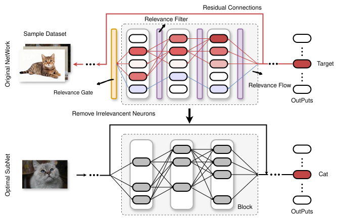

以下はXAIPrunerのREADMEである．実行方法などを確認することを目的とし，しばらくはそのまま残すこととする

-----

### **XAI-Pruner: Explainability-Driven Pruning of CNN and Transformer**

------

**XAI-Pruner** is an advanced pruning framework that leverages Explainable AI (XAI) techniques to achieve model compression while preserving high performance.  It employs the Layer-wise Relevance Propagation (LRP) to assess the contributions of individual network components, guiding a structured pruning process. 

To enhance the accuracy and stability of relevance allocation when applying LRP to deep networks with residual connections, XAI-Pruner introduces two novel mechanisms::

- **Relevance Gating**: Ensures that only the relevance from the residual path is propagated to the next block, effectively mitigating bias in relevance allocation
- **Relevance Filtering**: Enforces sparsity in relevance propagation, mitigating numerical instability and enhancing robustness

Furthermore, XAI-Pruner incorporates **Global Structure-Aware Pruning**, which optimizes pruning rates of different network components based on the unified relevance scale of relevance.

Experimental validation on DeiT and ResNet demonstrates that XAI-Pruner achieves substantial model compression while maintaining performance comparable to the original models, highlighting its effectiveness as an explainability-driven pruning approach.




#### Environment Setup

------

To set up the environment you can easily run the following command:

```shell
conda create -n XAIPruner python=3.10
conda activate XAIPruner
pip install -r requirements.txt
```

#### Data Preparation

------

You need to first download the [ImageNet-2012](http://www.image-net.org/) to the folder `./data/imagenet` and move the validation set to the subfolder `./data/imagenet/val`. The directory structure is the standard layout as following.

```
/path/to/imagenet/
  train/
    class1/
      img1.jpeg
    class2/
      img2.jpeg
  val/
    class1/
      img3.jpeg
    class/2
      img4.jpeg
```

We construct a compact dataset to compute the relevance of individual model components.  To generate the subImageNet in `/PATH/TO/IMAGENET`, you could simply run:

```shell
python ./lib/subImageNet.py --data-path /PATH/TO/IMAGENT
```

#### Quick Start

------

**Prune the Pre-trained Model**

For example, to prune **DeiT-B**, you can execute the following command. By default, the output path is set to `./`, but you can specify a different path using the `--output` argument. The `--resume` option specifies the path to the pre-trained model weights. Upon completion, it will generate a `state.yaml`  file a  `checkpoint_pruned.pth`  in the specified output directory.

```shell
python prune-ViT.py --data-path /PATH/TO/IMAGENT --model "deit_base_patch16_224" --resume "/PATH/TO/CHECKPOINT"  --output_dir "/OUTPUT_PATH" --batch-size 128  --prung_rate 0.5 
```

**Fine-tune the Pruned Model**

To fine-tune the pruned model, you can easily run the following command.  The `--cfg` argument specifies the configuration file (`.yaml`) of the pruned model structure, while the `--resume` argument loads the checkpoint of the pruned model (`checkpoint_pruned.pth`).

```shell
python -m torch.distributed.launch --nproc_per_node=8 --use_env fintune.py --model "deit_base_patch16_224" --data-path "/PATH/TO/IMAGENT" --cfg "/PATH/TO/.yaml" --resume "/PATH/TO/PRUNED/CHECKPOINT" --output_dir OUTPUT_PATH --epochs 300 --batch_size 128 --warmup_epochs 0 --cooldown_epochs 0 
```

**Evaluate our Pruned Model**

We provided our pruned models in `./checkpoints`. You can easily evaluate their performance using the following command. **Due to file size limitations, we only upload the checkpoint of the pruned DeiT-Base with a pruning rate of 0.5.**

```shell
python -m torch.distributed.launch --nproc_per_node=8 --use_env fintune.py --model "deit_base_patch16_224" --data-path "/PATH/TO/IMAGENT" --cfg "/PATH/TO/.yaml" --resume "/PATH/TO/PRUNED/CHECKPOINT" --eval
```


#### Performance

------

##### **Results on DeiT**

|     Model      |  Param   | $\downarrow\%$ | GFLOPs  | $\downarrow\%$ |    Acc    | $\Delta$  |      Compression Method      |
| :------------: | :------: | :------------: | :-----: | -------------- | :-------: | :-------: | :--------------------------: |
|   DeiT-Base    |   86.6   |       -        |  17.6   | -              |   81.84   |     -     |              -               |
|   DynamicViT   |   86.6   |      0.0       |  11.5   | 34.7           |   81.30   |   -0.54   |        Token Pruning         |
|   T2T-ViT-24   |   64.1   |      26.0      |  13.8   | 21.6           |   82.30   |   +0.46   |  Hand-crafted model Design   |
| S$^{2}$ViTE-B  |   56.8   |      34.4      |  11.8   | 33.1           |   82.22   |   +0.38   | Sparse Training (Structural) |
|  AutoFormer-B  |   54.0   |      37.6      |  11.0   | 37.5           |   82.40   |   +0.56   |             NAS              |
|    ViT-Slim    |   52.6   |      39.3      |  10.6   | 39.8           |   82.40   |   +0.56   |             NAS              |
|     VTP-B      |   47.3   |      45.4      |  10.0   | 43.2           |   80.70   |  -1.147   |      Structural Pruning      |
|     SAViT      |   42.6   |      50.8      |   8.8   | 50.0           |   82.54   |   +0.70   |      Structural Pruning      |
|    X-Pruner    |    -     |       -        |   8.5   | 51.7           |   81.02   |   -0.82   |      Structural Pruning      |
|      UVC       |    -     |       -        |   8.0   | 54.5           |   80.57   |   -1.27   |      Structural Pruning      |
| **XAI-Pruner** | **42.2** |    **51.3**    | **8.8** | **50.0**       | **82.57** | **+0.73** |    **Structural Pruning**    |
| **XAI-Pruner** | **25.0** |    **71.1**    | **5.3** | **69.9**       | **81.50** | **-0.34** |    **Structural Pruning**    |

|     Model      |  Param   | $\downarrow\%$ | GFLOPs  | $\downarrow\%$ |    Acc    | $\Delta$  |      Compression Method      |
| :------------: | :------: | :------------: | :-----: | :------------: | :-------: | :-------: | :--------------------------: |
|   DeiT-Small   |   22.1   |       -        |   4.6   |       -        |   79.85   |     -     |              -               |
|   DynamicViT   |   22.1   |      0.0       |   3.4   |      26.1      |   78.60   |   -1.25   |        Token Pruning         |
|    ViT-Slim    |   15.7   |      29.0      |   3.1   |      32.6      |   79.9    |   +0.05   |             NAS              |
| S$^{2}$ViTE-S  |   14.6   |      34.0      |   3.1   |      32.6      |   79.22   |   -0.63   | Sparse Training (Structural) |
|     SAViT      |   14.7   |      33.5      |   3.1   |      32.6      |   80.11   |   +0.26   |      Structural Pruning      |
| **XAI-Pruner** | **14.7** |    **33.5**    | **3.1** |    **32.6**    | **80.33** | **+0.48** |    **Structural Pruning**    |
| **XAI-Pruner** | **10.8** |    **51.1**    | **2.3** |    **50.0**    | **77.98** | **-1.87** |    **Structural Pruning**    |

|     Model      |  Param  | $\downarrow\%$ | GFLOPs  | $\downarrow\%$ |    Acc    | $\Delta$  |      Compression Method      |
| :------------: | :-----: | :------------: | :-----: | :------------: | :-------: | :-------: | :--------------------------: |
|   DeiT-Tiny    |   5.7   |       -        |   1.3   |       -        |   72.20   |     -     |              -               |
| S$^{2}$ViTE-T  |   4.2   |      26.3      |   1.0   |      23.7      |   70.12   |   -2.08   | Sparse Training (Structural) |
|     SAViT      |   4.2   |      26.3      |   0.9   |      24.4      |   70.72   |   -1.48   |      Structural Pruning      |
| **XAI-Pruner** | **4.2** |    **26.3**    | **0.9** |    **24.4**    | **70.99** | **-1.21** |    **Structural Pruning**    |

**Results on ResNet-50**

|     Model      | Base-Top1 | Pruned-Params | Pruned-GFLOPs | Pruned-Top1 | Params $\downarrow$ | GFLOPS $\downarrow$ |
| :------------: | :-------: | :-----------: | :-----------: | :---------: | :-----------------: | :-----------------: |
|     HRank      |   76.15   |     16.19     |     2.30      |    74.98    |        36.67        |        43.77        |
|     Taylor     |   76.18   |     14.20     |     2.25      |    74.50    |        44.44        |        45.12        |
|      CCP       |   76.15   |       -       |     2.11      |    75.50    |          -          |        48.54        |
|      RRCP      |     -     |     13.83     |     2.00      |    75.13    |        45.88        |        51.22        |
|    DepGraph    |   76.15   |       -       |     1.99      |    75.83    |          -          |        51.46        |
|       CC       |   76.15   |     13.20     |     1.92      |    75.59    |        48.36        |        52.93        |
|     ResRep     |   76.15   |     16.56     |     1.86      |    76.15    |        35.21        |        54.54        |
| **XAI-Pruner** | **76.15** |   **13.21**   |   **1.87**    |  **76.10**  |      **48.32**      |      **54.39**      |

